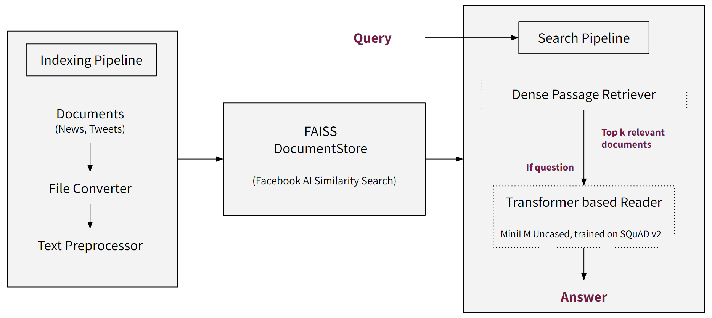

# Architecture

The above image shows a general structure of the application, but there are some additional details.

## Fetching Data and Mapping Files

The DocumentStore has to store documents and their embeddings after fetching them from the AlgoFabric database on the Cloud.

The AlgoFabric database entries have IDs which look like `Title + URL`, and so if we are storing the contents in a text file, the filename simply cannot be the ID as they contain special characters.

So, we generate UUIDs for each news/tweet document, and to keep track of which UUID corresponds to which actual ID in the AlgoFabric database, we also create a Mapping File where we store this info.

So, we

- Fetch all news/tweets from the AlgoFabric database.
- Assign each document a UUID, and keep track of this UUID along with the actual Database ID in some mapping dictionary in the code.
- Temporarily write the document contents into plaintext files whose filenames are the generated UUIDs.
- Process these plaintext documents and use Haystack's functions to write them to the DocumentStore. In the DocumentStore, each document now has a Metadata field containing the `name` parameter as the UUID.
- Write the mapping dictionary (which contains UUID - Database ID entries) to a Mapping File.
- Delete the temporarily generated plaintext files, as we no longer need them.
- Call the Update Embeddings function from Haystack to compute and write the embeddings into a FAISS Index file (part of the DocumentStore).

All of these are stored in the `data/` folder.

During the actual search, the Search Pipeline returns the documents, and each document has a metadata field called `name`, which is the filename from which the document was written, which is hence a _UUID.txt_ entry.

We can use this UUID to get the actual Database ID from the Mapping File, and the query the AlgoFabric database again to get all the details for the document. We do this because the AlgoFabric database also contains extra information, like Sentiment Analysis and other enrichment info from other tasks.

All of this is accomplished by the `fetch_from_DB.py` program. By default, it works on the current date, but it can also take command line arguments to specify a `--from` and `--to` date in the `YYYY-MM-DD` format.

The `.env` file contains all the variables that are loaded as environment variables where necessary. The paths give a general idea of the `data/` folder structure too.

## Creating Resources

There's a `create_models.py` program which can be run the very first time around, or when starting a fresh instance somewhere, to initialize directories, create an empty DocumentStore, and download models from HuggingFace.

## Application and Search API

The Application basically loads up everything, and serves a `/search/{query-string}` API on Port 8000. Since it is built with FastAPI, it can be viewed and tried out from the `/docs` endpoint too after running the application.

