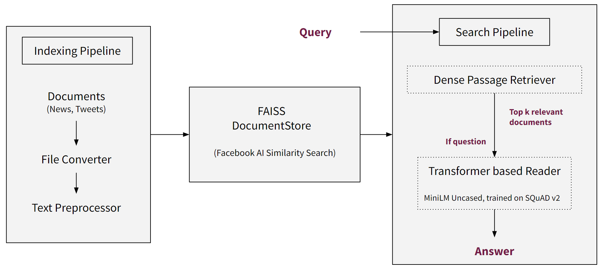

# Semantic Search + QnA

Semantic Search is a search system that takes into account the semantics, meaning and intent of a search query. Question-Answering (QnA) is the process of giving an answer to a question that is asked by the user.

Semantic Search is performed using Dense Passage Retriever (DPR). The search system returns top k (usually top 10) results. If the query is a question, it can be passed to a Reader model, which reads through just these top k (e.g. 10) documents and finds the most probable answer. The Reader performs Extractive QnA (meaning it extracts the answer from the whole documents).

We will look at the general project structure, usage, and some of the necessary background in this documentation.

## Overview

We have news and tweets in the AlgoFabric database, the goal is to perform a search over them. We will refer to news and tweets in general as documents.

- Indexing Pipeline
    - Documents (News and Tweets) converted to a common format (plain text)
    - Preprocessing: Removed whitespaces, removed header/footers, split the documents into chunks
- Document Store
    - sqlite database: Contains the actual document contents
    - FAISS Index file: Contains the word embeddings computed from the documents
- Search Pipeline
    - Query string passed into Dense Passage Retriever (DPR)
    - Top k (usually 10) search results removed. Semantic Search ends here.
    - If the query is a question (checked with a Classifier model), then pass the top k search results to a Reader
    - Reader reads through each of these top k documents and find the most probable answer to the question

## Usage

There are 4 main programs that are used.

1. `create_models.py`

    This creates the necessary resources required in a `data/` folder.

    - Initialize empty Document Stores for News and Tweets
    - Initialize empty Mapping Files (information covered in detailed architecture)
    - Download Models and store them
        - Dense Passage Retriever's Query and Passage Embedding Models
        - Question vs Statement Classifier Model
        - Reader Model for QnA
    

2. `fetch_from_DB.py`

    This fetches the documents from the AlgoFabric database (from AWS/Azure [currently Azure]), stores them in the Document Store, and computes the necessary embeddings and stores them too.

    This program must be run daily so as to keep the local DocumentStore up-to-date with the AlgoFabric database.

    It can be scheduled to run every few hours every working day too.

3. `remove_older_docs.py`

    This simply removes documents older than a set threshold (currently 30 days) from the DocumentStore, so as to keep the search results relevant.

    This can also be scheduled to run daily, or every few days, as needed.

4. `app.py`

    This is the main application, and it serves a `/search/{query-string}` API at `localhost:8000`. Since the API is built using FastAPI, it can be viewed and tried out from `localhost:8000/docs` (or more generally `siteurl:8000/docs`) too.

    This application must always be running. When the `fetch_from_DB.py` program updates the local data, the application does not need to be restarted; it can work with the newer data by itself.

